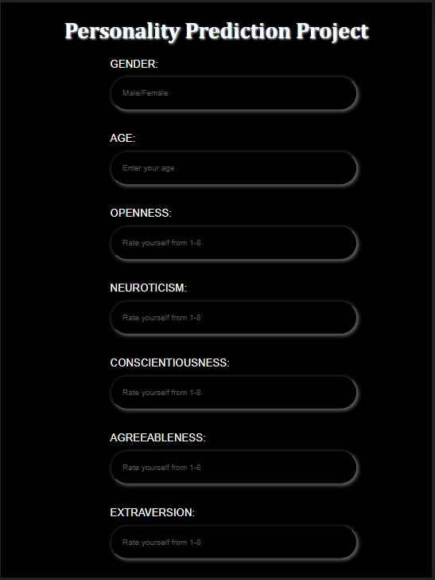

# PERSONALITY PREDICTION PROJECT

## Introduction :
The personality of a human plays a major role in his personal and professional life. Many organizations have also started shortlisting the candidates based on their personality as this increase efficiency of work because the person is working in what he is good at than what he is forced to do.  
The project is based on identifying the personality of an individual using machine learning algorithms and **Big Five Model** also known as Five-Factor Model which classify the personality of a person in some classes based on following behavourial data-  
- **Open to Experience**: It involves various dimensions, like imagination, sensitivity, attentiveness, preference to variety, and curiosity.
- **Conscientiousness**: This trait is used to describe the carefulness and diligence of the person. It is the quality that describes how organized and efficient a person is.
- **Extraversion**: It is the trait that describes how the best candidates can interact with people that is how good are his/her social skills.
- **Agreeableness**: It is a quality that analyses the individual behavior based on the generosity, sympathy, cooperativeness and ability to adjust with people.
- **Neuroticism**: This trait usually describes a person to have mood swings and has extreme expressive power.
  

## Approach :
Five characteristics of different individuals commonly known as big five characteristics namely, openness, neuroticism, conscientiousness, agreeableness and extraversion are stored in a dataset along with gender and age of indivitual and used for training. Before training the model, data is preprocessed like handling missing values, data discretization, standardization etc.This pre-processed data is then used to train the model. User rates himself for different behavourial characterstics and based upon the information provided by user his/her personality is predicted using trained ML model.
 
*Logistic Regression* algorithm is used to train the model with highest accuracy of 75% because it is best to predict the categorical dependent variable/ class labels using a given set of independent variables. Since, there were more than two classes so here multinomial logistic regression is used with *newton-cg* which is best while working with big datasets.
  

## Dataset Description :
**Attributes description**   
- Gender [Male/Female]
- Age [17-28]
- Openness [1-8]
- Neuroticism [1-8]
- Conscientiousness	[1-8]
- Agreeableness [1-8]
- Extraversion [1-8]

**Class Labels**
- Extraverted
- Serious
- Responsible
- Lively
- Dependable

  

## Setup Instructions:
1. Clone the repository  
`git clone https://github.com/Anjali2001saxena/Personality_Prediction_Project.git`
2. Change the current working directory  
`cd Personality_Prediction_Project`
3. Activate the virual environment  
`venv\Scripts\activate`
4. Install the requirements  
`pip install -r requirements.txt`
5. Run the app  
`python app.py`

## Tech Stack :
- Flask
- Python
- HTML
- CSS

**Libraries :**
- NumPy
- Sklearn
- Pandas
- Matplotlib

  

## Screenshots :

  

  

## Applications :
- Can be used to identify the right candidate based on his personality and skills
- Can be used to match marital profiles
